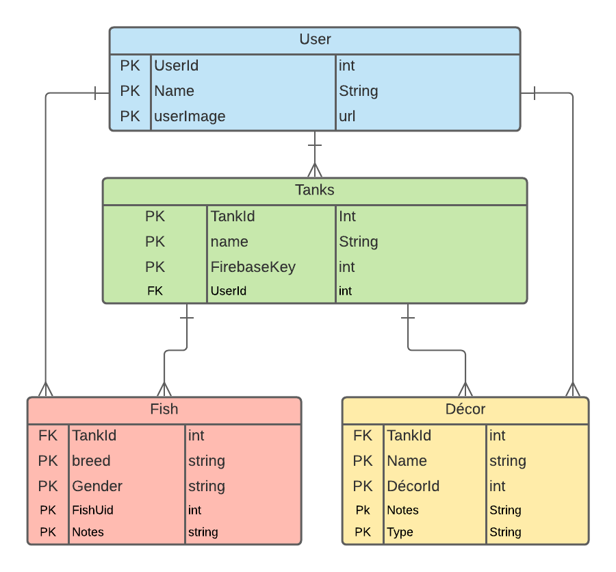

# Tankly

This is my front end capstone project for Nashville Software School. This site is for aquarium enthusiasts who want a nice dashboard to keep track of their various tanks, fish, and aquascapes. Users will be able to perform C.R.U.D. actions on their tanks, add notes, keep track of their fish and various décor! 

## ERD

## Wireframe
[see it here](https://www.figma.com/file/Ep3Ztus0QWnoCGbVLVqwBy/Untitled?node-id=1%3A7)
